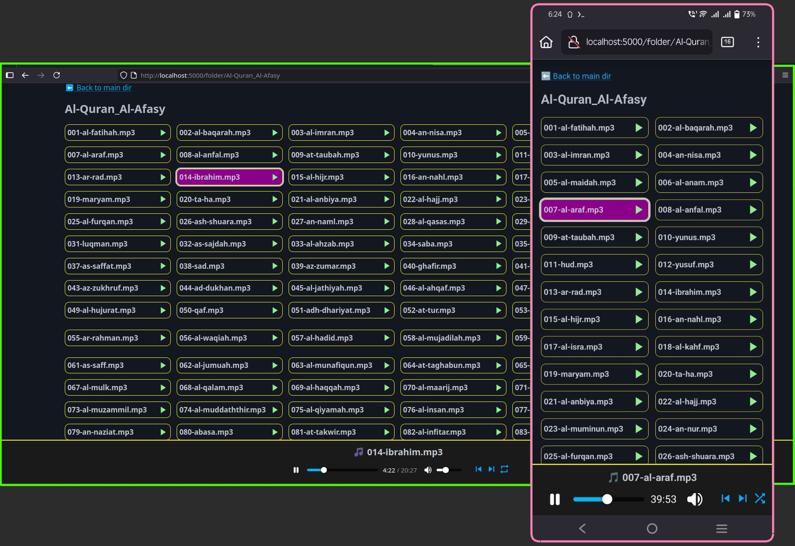

# Raihan's Local Audio Server



This is a self-hosted audio server built using **Flask** and **Gunicorn**, designed to serve audio files locally within a home or development environment.

The server is reverse-proxied through **Nginx**. It runs under the domain `audio.wraihan.loc` and is ideal for private use in LAN or offline setups.

Audio files are organized in directories and accessible via a web-based interface with built-in playback controls.

## Features

- Simple and responsive UI with dark mode support
- Organized folder structure for audio files (e.g. `Al-Quran_Al-Afasy/`)
- Playback with **play/pause**, **next**, **previous**, and **seek** controls
- Single toggle button cycling through playback modes:
  - Shuffle
  - Repeat One
  - Repeat All
  - Playback Off
- Proxy-ready for local domains via `nginx`
- Python project directory can be placed freely (e.g. in `$HOME`)

> 💡 This project is designed as a domain-based Python application that complements multiple backends+Nginx reverse proxy setup. Refer to my blog post entitled "[Nginx sebagai Proksi Songsang untuk Pelbagai Backend](https://wraihan.com/posts/nginx-proksi-songsang-pelbagai-backend/)" for full configuration steps.

## Requirements

- Python 3.10+
- Flask
- Gunicorn
- Nginx (for reverse proxy)

## Getting Started

1. Clone this repository
1. Set up your Python virtual environment
1. Run the server with Gunicorn:
   ```bash
   gunicorn --bind 127.0.0.1:5000 server:app
   ```
1. Ensure Nginx is configured to proxy your own domain to 127.0.0.1:5000
1. Visit http://your-domain/ in your browser

